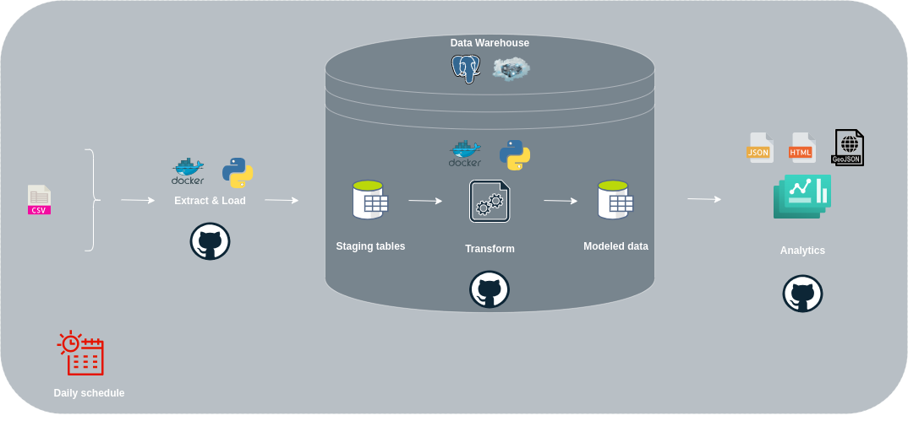

= nyc-collision-elt
:toc: left

== 🕵️‍♂️ Overview

ELT for New York City (NYC) Collision Dataset.

=== About me

Please, visit my https://github.com/Garcel[profile] 😀

=== About the project

This project was originally conceived in the year 2022, when I was employed by a data analytics company, but I was unable to complete it because of other commitments.

I've been considering finishing it a lot lately, so I've moved forward to do so.

It fascinates me and serves as a good illustration of how a straightforward data integration may be carried out.

I sincerely hope you find this as fascinating as I do, and any help would be appreciated.

=== Why an ELT?

First and foremost, I am aware that a simple Jupyter notebook would have sufficed for this project. However, the objective of this project revolves around developing a more intricate data integration process.

Although I have previous experience in a data analysis environment, I must admit that I do not possess extensive knowledge about data integration. Therefore, I recommend delving into additional resources to obtain a comprehensive understanding of this subject! :).

When it comes to designing this project, the utilization of either ETL (Extract, Transform, Load) or ELT (Extract, Load, Transform) approaches was taken into consideration.

The key distinction lies in the fact that ELT carries out data transformations directly within the data warehouse. In contrast, ETL involves staging procedures before the data can be transmitted to the warehouse.

Given my preference to avoid managing multiple systems for data storage, I decided to stick to the ELT approach.

== 🧅 Stack

- https://docs.docker.com/engine/[Docker] and https://docs.docker.com/compose/[Docker Compose]
- https://www.postgresql.org/[PostgreSQL] with http://postgis.net/[PostGIS]
- https://docs.python.org/3.12/whatsnew/3.12.html[Python 3.12]
** https://pypi.org/project/psycopg2/[psycopg2]
** https://pypi.org/project/requests/[requests]
** https://pypi.org/project/pandas/[Pandas]
** https://pypi.org/project/pytest/[pytest]
** https://pypi.org/project/pytest-cov/[pytest-cov]
** https://pypi.org/project/pre-commit/[pre-commit]
** https://pypi.org/project/ruff/[Ruff]
** https://pypi.org/project/black/[Black]
** https://pypi.org/project/mypy/[mypy]

== 🗄️ Data sources

https://data.cityofnewyork.us/Public-Safety/Motor-Vehicle-Collisions-Crashes/h9gi-nx95[Motor Vehicle Collisions - Crashes]

== ⚙️ The ELT

== 📈 The Dashboard

In progress...

== 💻 Development environment

I'll be using Docker to set up the development environment since I'm used to it and I very like it.

=== 📖 Prerequisites

You must have these installed in your system:

- Python 3.12 or Docker.
- pre-commit.

=== 🚀 Running it

[,bash,linenums,highlight=1]
-----
docker-compose up
-----

=== ✅ Running the tests

==== Python
[,bash,linenums,highlight=1]
-----
pytest
-----

==== Docker alternative
[,bash,linenums,highlight=1]
-----
docker build -t nyc . && docker run -v .:/app --rm nyc pytest
-----

== 🆘 Contributing

I would love your contributions and I'll do my best to provide you with mentorship and support. If you are looking for an issue to tackle, take a look at issues labeled Good first issue.

Get more details in the xref:CONTRIBUTING.adoc[Contributing Guide].

== 🛡️ Security

Please, do not create a regular Issue for reporting a Security issue.

See the xref:SECURITY.adoc[Security Policy] to known more about the procedure details.

== 🪪 License

Apache License 2.0.

== ✍🏼 Author

mailto:garcel.developer@gmail.com["José Antonio Garcel",nyc-collision-elt]

June 17th, 2023.
